# Steam Achievement Tracker

Our web application is deployed at -> [https://achievements-tracker-steam.herokuapp.com/](https://achievements-tracker-steam.herokuapp.com/).

Further instructions can be found below.

## Quick Navigation
- [Launching the website](#starting-the-app)
- [App Walkthrough](#app-walkthrough)
- [Logging in](#login-and-sign-up-pages)
- [Finding your Steam ID](#steam-info-page)
- [Viewing the Dashboard](#dashboard)
- [Viewing the Review Forum](#review-forum)
- [Game Achievements](#game-achievements)
- [Game Analytics](#game-analytics)
- [Account Settings](#account-settings)
- [Administrator page](#admin-page)

## Starting the app
1. Clone the app: `git clone git@github.com:csc309-winter-2021/team29.git` or  
`git clone https://github.com/csc309-winter-2021/team29.git`

2. From the root directory(`team29`), simply run `bash start.sh`. This will cd into the directory and run `npm install` and `npm start`.

3. You should be able to open the webpage in a browser window by entering `localhost:5000` in the URL bar. We have tested the webpage on a fully-maximized browser window in Google Chrome.

## App Walkthrough
1. When the app opens at `localhost:5000` or at the deployed Heroku link above, you should see this welcome screen:  
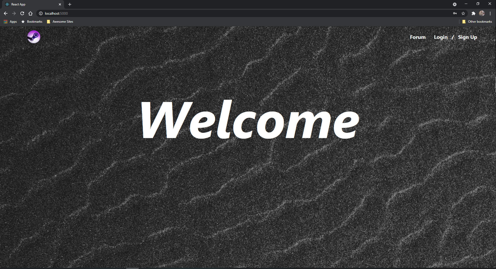

2. From here, you can click on either [Forum](#review-forum) to view the Review Forum as a guest (you won't be able to publish new reviews or vote on existing reviews), or proceed to the [Login](#login-and-sign-up-pages) or [Sign Up](#login-and-sign-up-pages) screens.

### Login and Sign Up pages
1. The login page should look like this:  
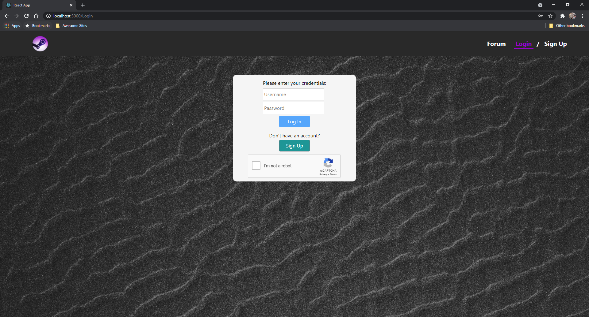

2. Here, you can log in as either an `admin` or `user` (or view limited parts of the website such as the Review Forum as a guest, without logging in). We also have a captcha feature to prevent too many requests to the server. The login button will be enabled once the captcha has been solved.

3. For testing purposes, you can use the following 4 user accounts (note that they all use the same Steam ID, but you are welcome to create some new accounts with the sample Steam IDs provided below in Step 6) and 1 admin account to try out the functionality on our web app:

User Accounts - more can be created through our web sign up interface

Username: `user` 
Password: `user`

Username: `user1`
Password: `user1`

Username: `user2`
Password: `user2`

Username: `user3`
Password: `user3`

Admin Account - this is the only account available, but you can create more admins using the API route. An admin in our system is any user with a username starting with the characters `admin`.

Username: `admin`
Password: `admin`

4. If you don't already have an account, or would like to make a new one, you can also access the sign up page from here, by clicking on the `Sign Up` button. It should look like this:  
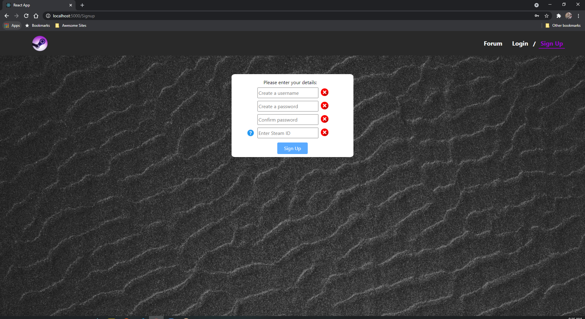

5. We have implemented checks to make sure each field is filled in properly and that the passwords match. Usernames and passwords must be at least 4 characters long, and you must enter a valid Steam ID to proceed (we have preliminary checks to verify the validity of the Steam ID too). Once those conditions are fulfilled, clicking the `Sign Up` button will display an alert indicating that sign up was successful, and you will be directed to the `Login` page to proceed with your new account.

6. If you don't know how to find your Steam ID, you can click the help icon which will take you to the [Steam Info](#steam-info-page) page. Follow the instructions here to find your profile's unique Steam ID, or you can use one of ours for testing purposes :)

Here are some sample Steam IDs for you to try out if you want: `76561198072072686`; `76561198882892406`; `76561198059305613`; `76561198158301094`

### Steam Info Page
1. The Info page should look like this:
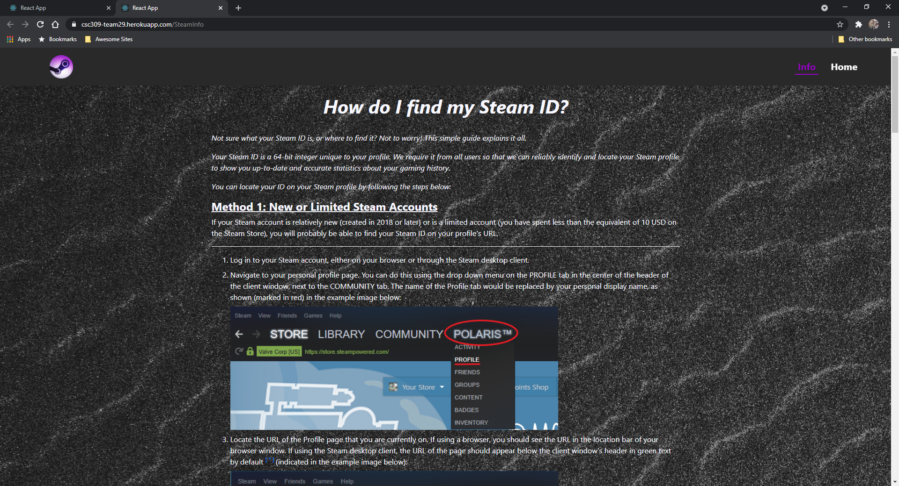

2. This is an instructional guide meant to assist you in setting up your Steam profile and gathering relevant information (most notably your unique Steam ID), so that you can seamlessly complete the Signup and Login processes for our website, and we can provide you with a populated profile with the relevant data visualizations.

3. Please follow all the instructions on this page if you are not sure how to find the unique Steam ID of your profile, and/or have signed up for an account but see an empty/unpopulated profile.

### Dashboard
1. This is the dashboard page:  
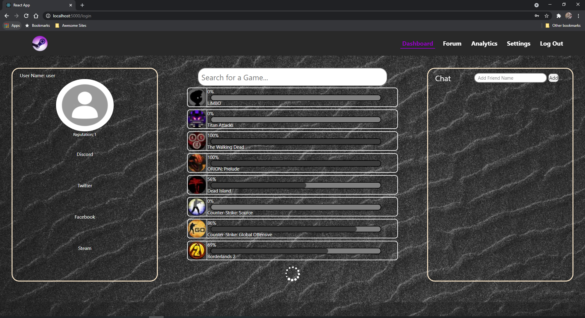

2. Here, you have your user profile on the left-side panel with links to various apps that gamers might use. In the middle panel of the page, you have a list of all games on your Steam account, with a progress bar for each game on your profile that supports achievements. Please note that depending on how many games you own, it may take a few minutes to pull all the relevant game data, indicated by the presence of the white loading icon at the bottom of the page. You may also observe some games being deleted from the games list; don't be alarmed, this just means the removed games likely don't support Steam achievements.

3. You can also use the game search bar to search for a specific game instead of scrolling through. Note that the search results are updated automatically once you insert any text.

4. After your games list has loaded, you can click on each game in the list and go to its corresponding [Game Achievements](#game-achievements) page to look at an overview of all achievements in the game.

5. On the right-side panel, you have your friends list. This is where you can see all incoming friend requests (that you can choose to accept or decline), as well as your current friends list. You may send a friend request to a user if you know their username using the 'Enter Friend Name' input field and 'Add' button. You may remove a friend by clicking on the delete icon next to their name, and you can also click on a friend to start a chat with them. The timestamps for messages are accurate, chat history will persist across different sessions and is unique to each pair of users.
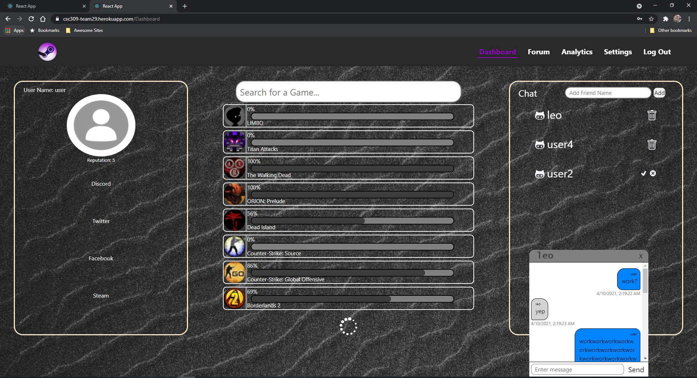

6. Clicking the [Settings](#account-settings) button on the top right hand corner will bring you to the Account Settings page.

7. You may also click on the [Analytics](#game-analytics) button to view the overall game analytics of your profile.

### Game Achievements
1. The game achievements page for a specific game will look something like this:  
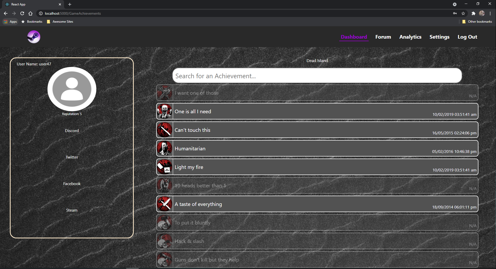

2. You will be presented with a list of all achievements the selected game currently supports. Coloured achievement bars correspond to achievements you have unlocked, and you will also see the date and time you unlocked said achievement on the bottom right of the bar, while greyed-out achievement bars correspond to achievements you have not unlocked yet.

3. You can also use the search bar to search for specific achievements that the game may have. Just like on the Dashboard, search results are updated automatically once you insert any text.

### Game Analytics
1. The game analytics page looks like this:  
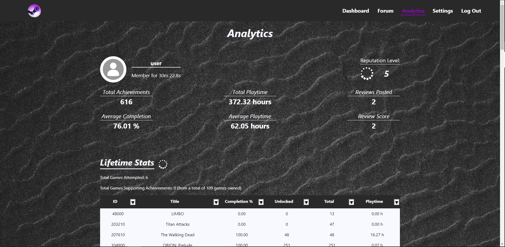

2. From here, you can view useful and interesting statistics about your gaming lifetime such as your overall reputation score, total achievements unlocked, completion percentage, and total playtime in the banner at the top of the page. You can also view a breakdown of your statistics by each individual game the Lifetime Statistics table at the bottom of the page. You can also sort the table in ascending or descending order by each column using the arrow buttons on each column's header. The example below is sorted in decreasing order of playtime for games:
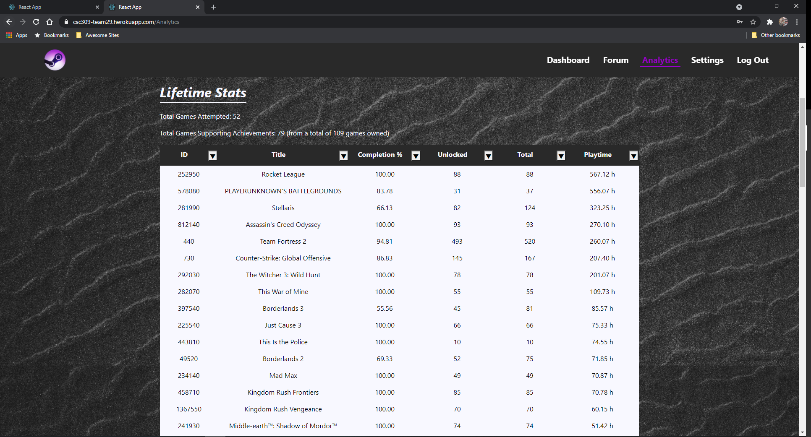

3. Please note that just like on the Dashboard, it may take a few minutes to pull all the relevant game data depending on how many games you own, indicated by the presence of the white loading icon at the bottom of the page. Similar to the game list on the Dashboard, you may observe some games being deleted from the Lifetime Stats table; don't be alarmed, this just means the removed games likely don't support Steam achievements.

4. After your Lifetime Stats table has been fully populated, your Reputation score will be updated again, as it is a function of your completion statistics and total review score. If it changes, it will persist across all pages (such as the Dashboard and Review Forum).

### Account Settings
1. The account settings page looks like this:  
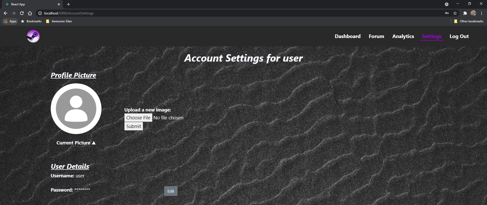

2. From here, you can edit the specifics of your profile, like uploading a new profile picture or updating your password, using the relevant edit buttons.

### Review Forum
1. The review forum is a place where you can leave reviews for games; it starts with the most recent reviews posted on the site:
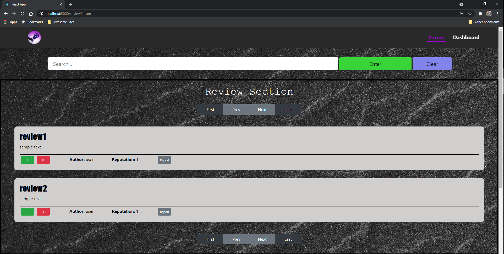
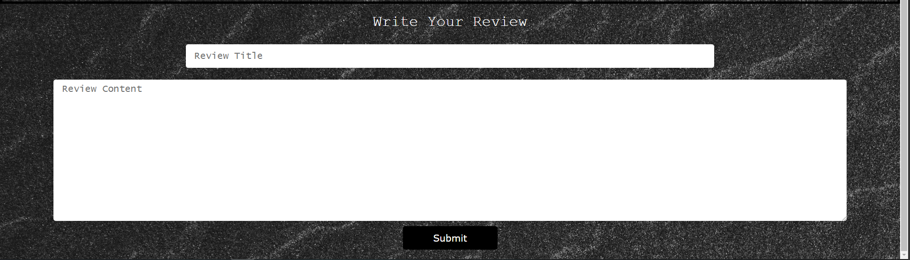

2. Here you can add a review if you are logged in, and upvote or downvote a review. You will also see some of the review author's details, such as their name and reputation, and you may report an inappropriate review as well.

3. More published reviews (if there exist any) can be viewed by clicking on the `next` button to see the next page. You may also use the `first` and `last` buttons to skip to the relevant pages of reviews.

4. You may also notice some reviews have a 'Show Content' button in place of the review content. This is an automatic check we do upon rendering the page to avoid long reviews taking up too much space on the page. You can choose to expand such reviews if you wish to read their content.

### Admin Page
1. The admin page looks like this:  
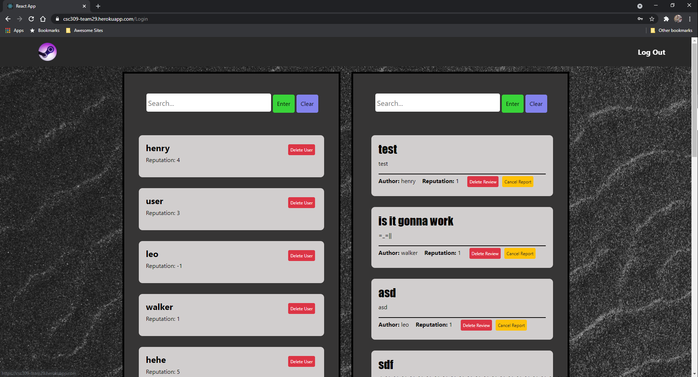

2. From this page, you can do things like delete or edit reviews, and also delete or ban users. You also must be logged in as an admin to access this page.

3. Also note that we have separated admins from regular users, which means this page's functionality is mutually exclusive to regular user functionality. Admins cannot access regular user functionality like custom profiles, game achievement analytics, or reviews, and vice versa.
